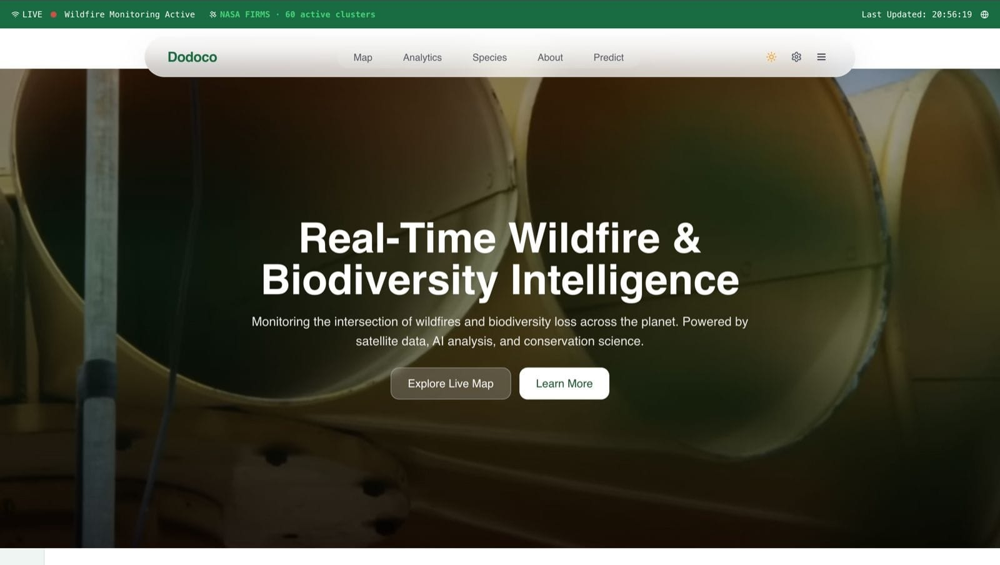
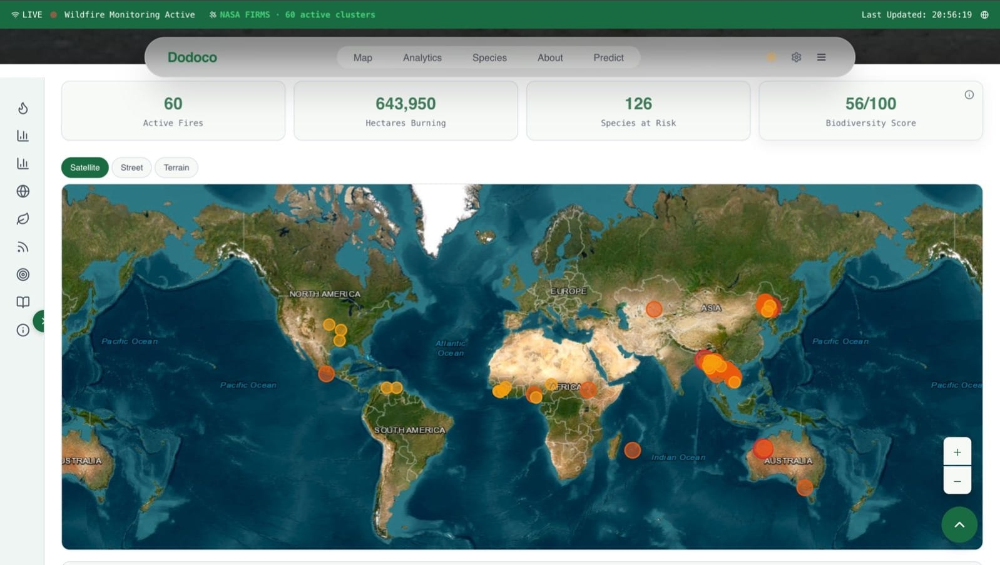
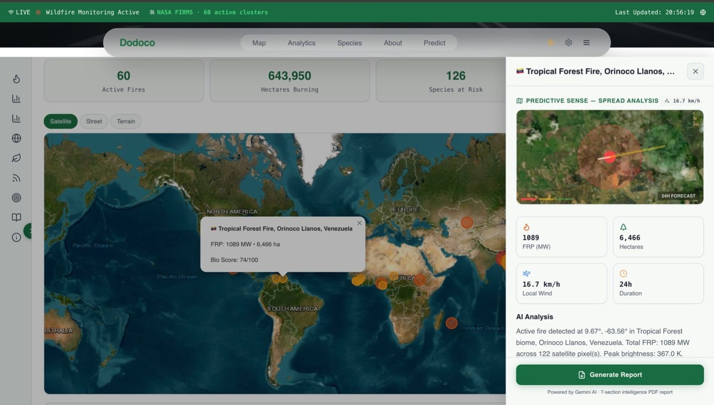
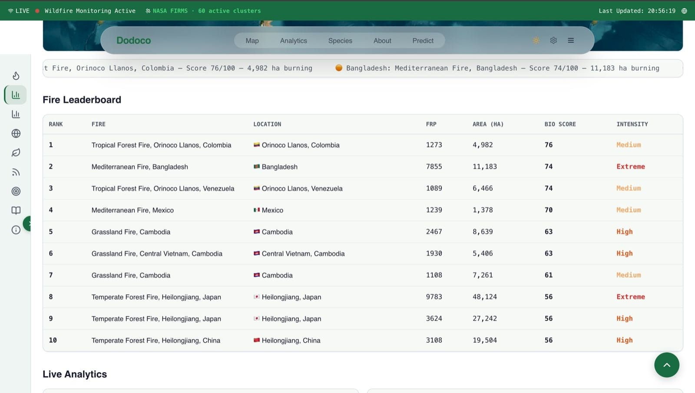
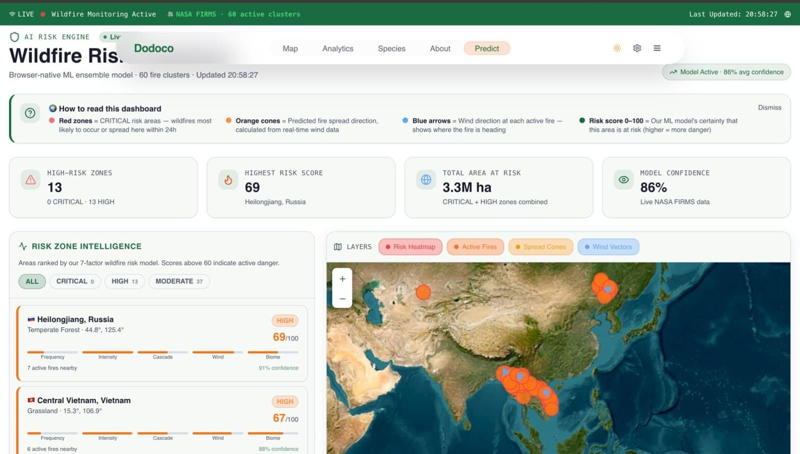
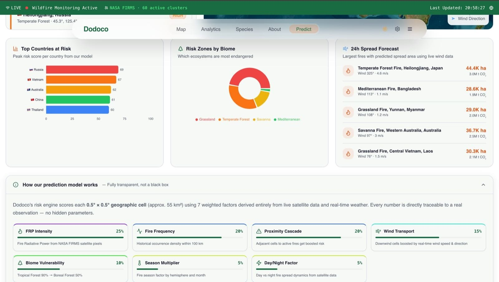
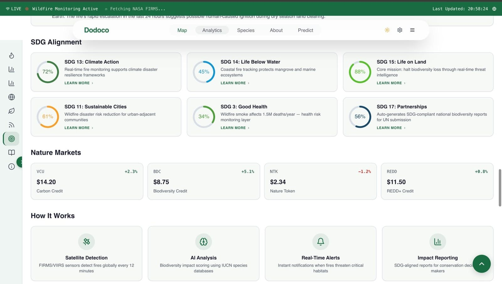

# 🔥 Dodoco: Real-Time Wildfire & Biodiversity Intelligence



**Dodoco** is a comprehensive, real-time monitoring platform at the intersection of global wildfires and biodiversity loss. Powered by live satellite data, artificial intelligence, and conservation science, Dodoco provides actionable intelligence to track, analyze, and predict wildfire threats to critical ecosystems worldwide.

---

## 🌍 Overview

As wildfires increasingly threaten global biodiversity, Dodoco serves as a centralized intelligence hub. It aggregates live data from NASA FIRMS and combines it with biological impact scoring to provide a holistic view of ecological threats. 

**Core capabilities:**
* **Satellite Detection:** Global fire detection updated every 12 minutes using FIRMS/VIIRS sensors.
* **AI Analysis:** Biodiversity impact scoring using IUCN species databases and Gemini AI for automated reporting.
* **Real-Time Alerts:** Instant notifications when active fires threaten critical habitats.
* **Impact Reporting:** SDG-aligned intelligence reports auto-generated for conservation decision-makers.

---

## ✨ Key Features

### 🗺️ Live Global Monitoring
Track active fire clusters across the globe with real-time statistics including total hectares burning, species at risk, and an overall biodiversity threat score.


### 🤖 AI-Powered Incident Reports & Predictive Sense
Click on any active fire to view detailed metrics like Fire Radiative Power (FRP), affected area, and local wind speeds. Dodoco uses AI to generate instant, localized reports on the biome and species affected, alongside a 24-hour spread forecast.


### 📊 Fire Leaderboard & Analytics
Rank active fires globally based on their severity, size, and biological impact score. Easily identify extreme and high-intensity threats at a glance.


### 🔮 Predictive Risk Engine
A browser-native ML ensemble model that calculates wildfire risk using real-time weather and satellite data. It visualizes high-risk zones, spread cones, and wind vectors with high confidence.


#### 🧠 Transparent 7-Factor Prediction Model
Our risk engine scores each geographic cell (~55 km²) using 7 weighted factors, fully transparent and traceable to real observations:
1. **FRP Intensity (25%)**: Fire Radiative Power from NASA FIRMS.
2. **Fire Frequency (20%)**: Historical occurrence density within 100km.
3. **Proximity Cascade (20%)**: Boosted risk for cells adjacent to active fires.
4. **Wind Transport (15%)**: Real-time wind speed and direction data.
5. **Biome Vulnerability (10%)**: Danger levels based on ecosystem type (e.g., Tropical Forest vs. Grassland).
6. **Season Multiplier (5%)**: Hemisphere and month-based fire season factoring.
7. **Day/Night Factor (5%)**: Satellite-derived spread dynamics based on time of day.


### 🎯 SDG Alignment & Nature Markets
Dodoco explicitly maps its impact to the UN Sustainable Development Goals (SDGs 11, 13, 14, 15, 3, and 17) and tracks live trends in Nature Markets (Carbon Credits, Biodiversity Credits, Nature Tokens).


---

## 🛠️ Tech Stack

* **Frontend:** React, TypeScript, Tailwind CSS, Vite
* **Maps & Visualization:** WebGL-based mapping (Mapbox/Leaflet/Deck.gl)
* **Live Data APIs:** NASA FIRMS API, Real-time Weather APIs, IUCN Red List
* **AI Integration:** Google Gemini AI (for automated report generation)
* **Deployment:** Vercel / Netlify

---

## 🚀 Getting Started

To run Dodoco locally:

**1. Clone the repository**
```bash
git clone [https://github.com/Akshxx/Dodoco.git](https://github.com/Akshxx/Dodoco.git)
cd Dodoco
